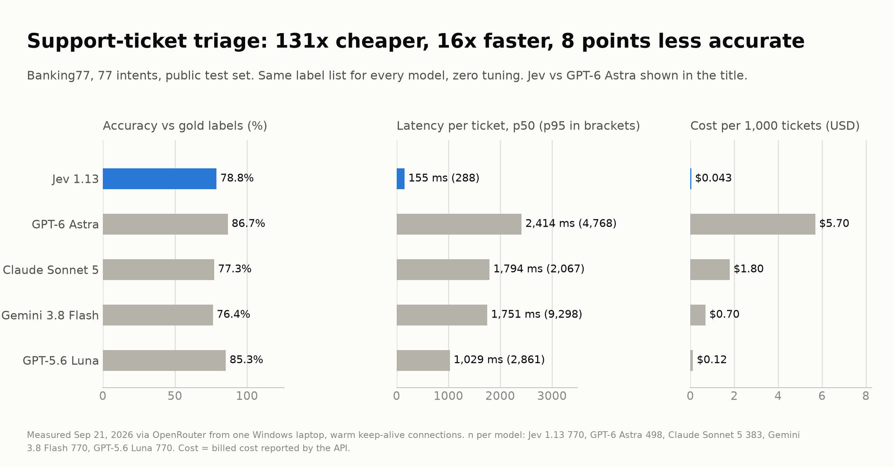
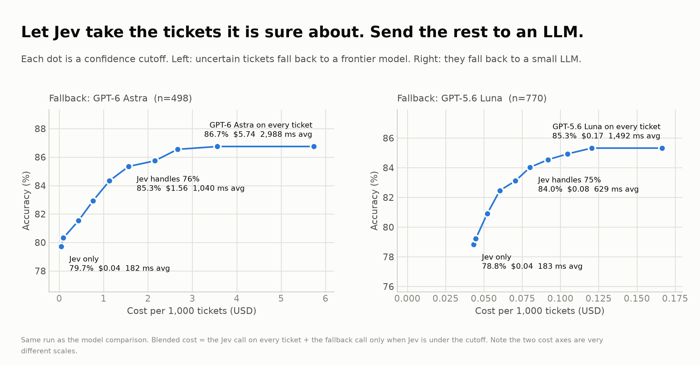

# Lane 1: Cost-cut migration

**Question:** a company pays a big LLM to triage support tickets. What happens if that decision moves to a purpose-built decision model (TypeSafe's Jev), with an LLM only as the fallback?

## Setup

- **Task:** Banking77, 77-way support-ticket intent classification, public test set with gold labels.
- **Same information for every model:** the identical list of 77 label names. No descriptions, no few-shot examples, no prompt tuning for anyone.
- **Measured from one Windows laptop through OpenRouter**, warm keep-alive connections, Sep 21 2026. Cost is the billed cost the API reported per call, not a price-sheet estimate.
- **Sample:** 770 tickets (10 per intent, seed 7). Jev was also run on the full 3,076-ticket test set. The two frontier models were stopped early to control spend, so they have fewer rows (n is in the table). Every comparison against them uses Jev's score on the same rows.

## Results

| Model | n | Accuracy | p50 latency | p95 latency | Cost per 1,000 tickets |
|---|---|---|---|---|---|
| Jev 1.13 | 770 | 78.8% | 155 ms | 288 ms | $0.043 |
| GPT-6 Astra | 498 | 86.7% | 2,414 ms | 4,768 ms | $5.70 |
| GPT-5.6 Luna | 770 | 85.3% | 1,029 ms | 2,861 ms | $0.12 |
| Claude Sonnet 5 | 383 | 77.3% | 1,794 ms | 2,067 ms | $1.80 |
| Gemini 3.8 Flash | 770 | 76.4% | 1,751 ms | 9,298 ms | $0.70 |

Jev on the full test set (n=3,076): 80.0% accuracy, 156 ms p50. Gemini returned a label that was not in the list 102 times out of 770; Jev cannot do that, its output is constrained to the options.



## What the numbers say

1. **The biggest saving has nothing to do with Jev.** GPT-5.6 Luna is within 1.4 points of GPT-6 Astra at 1/46th of the cost. Anyone classifying with a frontier model is overpaying by a wide margin.
2. **Jev alone is not accurate enough to replace a good LLM here.** 78.8% vs 85 to 87%. It is 131x cheaper and about 16x faster than Astra, and 2.8x cheaper and 6.6x faster than Luna.
3. **Jev's confidence score is what makes it usable.** Let Jev keep only the answers it is sure about and send the rest to an LLM:

| Setup | Jev handles | Accuracy | Avg latency | Cost per 1,000 |
|---|---|---|---|---|
| GPT-6 Astra on every ticket | 0% | 86.7% | 2,806 ms | $5.70 |
| Jev, fallback to Astra (cutoff 0.95) | 57% | 86.5% | 1,614 ms | $2.67 |
| Jev, fallback to Astra (cutoff 0.8) | 76% | 85.3% | 1,040 ms | $1.56 |
| GPT-5.6 Luna on every ticket | 0% | 85.3% | 1,310 ms | $0.12 |
| Jev, fallback to Luna (cutoff 0.8) | 75% | 84.0% | 629 ms | $0.08 |

The last row vs the first: 71x cheaper and 4.5x faster for 2.7 points of accuracy. With Luna as the fallback, Jev adds little cost saving (35%) but cuts average latency by about half.



## Caveats

- One dataset, one afternoon, zero tuning. Banking77 has known label noise; nobody scores 100% on it.
- Latency includes my home network to OpenRouter. Absolute numbers will differ from a datacenter; the ratios are what matter.
- Astra and Sonnet ran with reasoning effort "low". Cutoffs were read off the same test rows, so treat the cascade table as an illustration, and pick cutoffs on held-out data in a real migration.

## Reproduce

```
..\.venv\Scripts\python bench.py --n-per-intent 10 --jev-all
..\.venv\Scripts\python ..\common\charts.py
..\.venv\Scripts\python ..\common\facts.py
```

Needs `OPENROUTER_API_KEY`. Runs are checkpointed in `results/*.jsonl`, so a rerun only pays for rows that are missing. The run refuses to start if the key's balance is under $5 (`JEV_BENCH_FLOOR_USD`).
