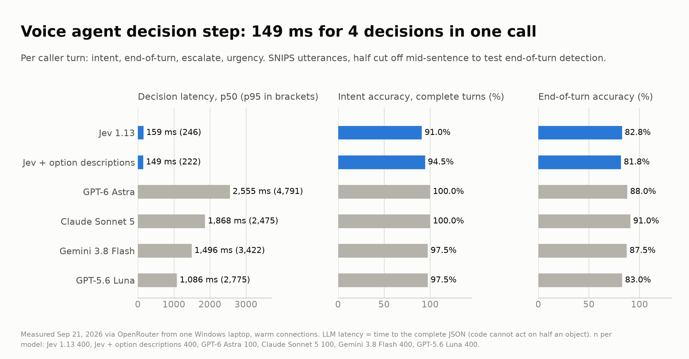
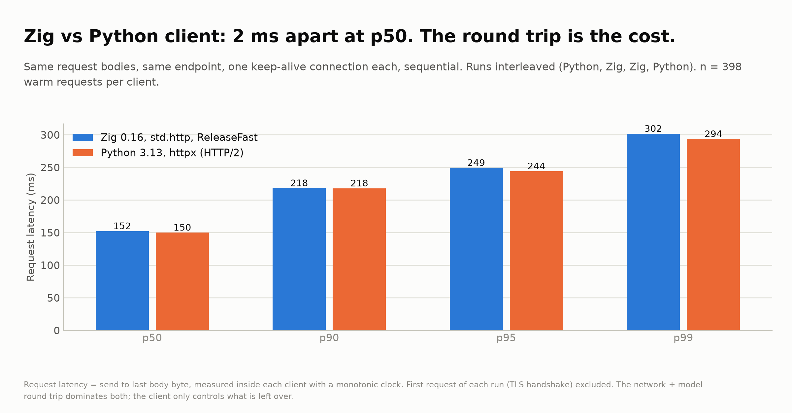

# Lane 2: The decision layer inside a voice agent

**Question:** a phone agent has roughly 800 ms between "caller stops talking" and "agent starts talking" before the call feels broken. Speech-to-text and text-to-speech eat most of that. How long does the deciding in the middle take?

Per caller turn the code needs four answers before anything is spoken: what the caller wants (intent), whether they have finished talking or just paused (end-of-turn), whether they want a human or sound upset (escalate), and how urgent it is.

Jev answers all four in one request, in parallel. An LLM has to write a JSON object token by token, and code cannot act until the whole object has arrived, so LLM latency here is time to the complete response.

## Setup

- **Data:** SNIPS voice-assistant utterances (public, 7 gold intents). 400 turns: 200 complete, 200 cut off at a random point 35 to 70% of the way through.
- **End-of-turn labels are mechanical:** complete utterance = finished, cut utterance = not finished. Some cuts still read as a complete sentence, so nobody can score 100% on that label. Same noise for every model.
- Escalate and urgency have no gold labels. They are in the request so the latency reflects a realistic four-decision turn.
- Measured from one Windows laptop through OpenRouter, warm connections, Sep 21 2026. Frontier models ran on the first 100 turns to control spend.

## Results

| Model | n | p50 | p95 | Turns under 300 ms | Intent accuracy | End-of-turn accuracy | Cost per 1,000 turns |
|---|---|---|---|---|---|---|---|
| Jev 1.13 | 400 | 159 ms | 246 ms | 98.8% | 91.0% | 82.8% | $0.023 |
| Jev + one-line option descriptions | 400 | 149 ms | 222 ms | 98.0% | 94.5% | 81.8% | $0.028 |
| GPT-5.6 Luna | 400 | 1,086 ms | 2,775 ms | 0% | 97.5% | 83.0% | $0.079 |
| Gemini 3.8 Flash | 400 | 1,496 ms | 3,422 ms | 0% | 97.5% | 87.5% | $0.22 |
| Claude Sonnet 5 | 100 | 1,868 ms | 2,475 ms | 0% | 100% | 91.0% | $0.83 |
| GPT-6 Astra | 100 | 2,555 ms | 4,791 ms | 0% | 100% | 88.0% | $3.21 |



## What the numbers say

1. **Only Jev fits inside a voice budget.** The fastest LLM is 6.8x slower at p50, and not one LLM turn out of 1,000 came back under 300 ms. A one-second decision step means the caller hears dead air every turn.
2. **Jev gives up accuracy for that speed.** 91.0% intent accuracy with bare label names, 94.5% after writing a one-line description per option (ten minutes of work), against 97.5 to 100% for the LLMs. End-of-turn is level with the small LLM and 5 to 8 points behind the bigger ones.
3. **The sane architecture uses both.** Jev decides every turn in about 150 ms. When its confidence is low, the agent says a filler ("one second") and asks the slower model. The expensive path runs only when it is needed.

## The Zig experiment (`zig/`)

I wanted to know whether rewriting the client in Zig buys speed. `zig/jevfast.zig` (Zig 0.16, std only, ReleaseFast, no allocation in the timed loop) and a Python httpx client sent the same 200 requests over one keep-alive connection each, interleaved Python, Zig, Zig, Python.

| Client | n (warm) | p50 | p95 | p99 |
|---|---|---|---|---|
| Zig 0.16 std.http | 398 | 152.3 ms | 249.4 ms | 301.7 ms |
| Python 3.13 httpx | 398 | 150.1 ms | 244.2 ms | 293.6 ms |



**No difference.** The network and model round trip is about 150 ms and the client's share of it is a rounding error in either language. Zig's first request was slower (335 and 240 ms cold vs 185 and 208 ms) because it scans the Windows certificate store on startup. Where Zig does earn its place in a voice stack is on the audio side: voice-activity detection, ring buffers and anything else that runs next to the audio thread, where a garbage-collector pause is an audible glitch. It does not make an API call faster, and anyone selling a rewrite for that reason is selling nothing.

## Caveats

- SNIPS is clean text. Real speech-to-text output is messier and accuracy will drop for every model.
- Latency is from a home connection in Los Angeles. A server in the same region as the API will be faster for every model; the gap between them will not close.
- Jev's end-of-turn cutoff was left at 0.5. Tuning it on held-out data is the obvious next step.

## Reproduce

```
..\.venv\Scripts\python bench.py --n 200 --n-frontier 100
cd zig
zig build-exe -O ReleaseFast jevfast.zig
..\..\.venv\Scripts\python py_latency.py 200 ; .\jevfast.exe 200
```
