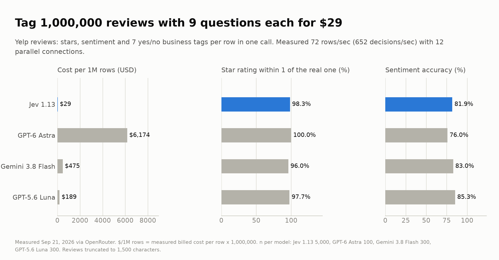

# Lane 3: Bulk tagging ("read every row")

**Question:** a business has a pile of reviews, tickets, call notes or CRM records. Can it afford to have a model read all of it, and ask more than one question per row?

## Setup

- **Data:** Yelp review_full public test set, 5,000 reviews sampled (seed 7), truncated to 1,500 characters. Gold label: the real 1 to 5 star rating.
- **Per row, one Jev request answers 9 questions in parallel:** star rating, overall sentiment, and 7 yes/no business tags (mentions staff, price, wait time, cleanliness, asks for compensation, will return, health or safety problem).
- **Gold-checked:** stars (exact, within 1, mean absolute error) and sentiment (1 to 2 stars negative, 3 mixed, 4 to 5 positive).
- **Not gold-checked:** the 7 tags. For those I report agreement with GPT-6 Astra on the same rows. Agreement is not truth, it only says the cheap model and the expensive one see the same thing.
- LLM baselines got the same 9 questions in one JSON prompt. Luna and Gemini on 300 rows, Astra on 100, to control spend. Measured through OpenRouter from one Windows laptop, Sep 21 2026.

## Results

| Model | n | Stars exact | Stars within 1 | Sentiment | Cost per 1M rows |
|---|---|---|---|---|---|
| Jev 1.13 | 5,000 | 67.1% | 98.3% | 81.9% | $29 |
| GPT-5.6 Luna | 300 | 66.7% | 97.7% | 85.3% | $189 |
| Gemini 3.8 Flash | 300 | 71.7% | 96.0% | 83.0% | $475 |
| GPT-6 Astra | 100 | 66.0% | 100% | 76.0% | $6,174 |

Jev on the same 300 rows as the LLMs: 66.3% exact, 98.3% within 1, 81.0% sentiment, so the 5,000-row figure is not flattered by the larger sample.

**Tag agreement with GPT-6 Astra (100 rows):** Jev 97.1% on average (lowest tag: "will return" at 89%), Luna 96.7%, Gemini 96.1%.

**Throughput:** 5,000 rows in 69 seconds with 12 parallel connections from a laptop: 72 rows per second, 652 decisions per second, about 3.8 hours per million rows, zero failed or unparseable rows. Gemini returned 8 unparseable rows out of 300.



## What the numbers say

This is the lane where Jev wins outright. Quality is within a few points of the LLMs on everything I could check against gold (ahead on star rating within 1, 1 to 3 points behind the small LLMs on sentiment), and it is 6.5x cheaper than the cheapest LLM, 16x cheaper than Gemini Flash and 212x cheaper than GPT-6 Astra. At $29 per million rows with nine questions each, reading everything stops being a budget decision. Extra questions are nearly free because the review is only ingested once.

## Caveats

- $/1M rows is measured cost per row times 1,000,000. Longer documents cost proportionally more.
- Sentiment "accuracy" depends on my mapping of 3 stars to "mixed"; all models were scored against the same mapping.
- Astra's sample is only 100 rows, so its accuracy figures carry a wide error bar. Its cost figure does not.
- Throughput was limited by my 12 connections, not by a rate limit I hit. I did not test how far it scales.

## Reproduce

```
..\.venv\Scripts\python bench.py --n 5000 --n-llm 300 --n-frontier 100 --workers 12
```
